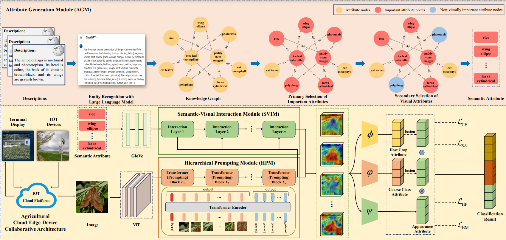

# HAPZero
[](https://pytorch.org/) 

 - [*HAPZero: Hierarchical Attribute Prompting Based Zero-Shot Learning for Pest Recognition*](https://arxiv.org/abs/2303.15322)
    This repository contains the reference code for the paper "**HAPZero: Hierarchical Attribute Prompting Based Zero-Shot Learning for Pest Recognition**".
    
    


## 🌈 Model Architecture



## 📚 Dependencies

- ```Python 3.6.7```
- ```PyTorch = 1.7.0```
- All experiments are performed with one  RTX 4090 GPU.

# ⚡ Prerequisites
- **Dataset**: please download the dataset, i.e., [IP102](https://github.com/xpwu95/IP102) to the dataset root path on your machine, Datasets can be download from [Xian et al. (CVPR2017)](https://datasets.d2.mpi-inf.mpg.de/xian/xlsa17.zip) and take them into dir ```./datasets/```.
- **Data split**: dataset split files for the three groups are placed at ```./data/xlsa19/split```
- **Attribute w2v**: download from link [IP102 Att](https://drive.google.com/drive/u/1/folders/183ZKKFfRZfC20tqh0oDlom_H0lAMNsXk) and place it in ```./data/xlsa/w2v```.
- Download pretranined vision Transformer as the vision encoder and place it in ```./pretrain_model_vit```.

## 🚀 Train & Eval
Before running commands, you can set the hyperparameters in config on different datasets: 
```
config/ip102.yaml       #IP102
```
Train:
```shell
 python train.py
```
Eval:

```shell
 python test.py
```

You can test our trained model: [GroupA](https://drive.google.com/drive/u/1/folders/1r_otWbwhRQdh_JQL8dl2JL3yKVq_MKSn), [GroupB](please wait), [GroupC](please wait).


## 📕 Ackowledgement
We thank the following repos providing helpful components in our work.
[PSVMA](https://github.com/ManLiuCoder/PSVMA)
